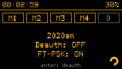
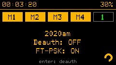

# User guide

## Cotnrols

### CardPuter

- navigation through menu: arrow up/down
- select menu item: enter
- exit from function: esc

### StickCPlus2

- navigation through menu: button B/pwr button
- select menu item: button A
- exit from function: button B

## WiFi handshake capture full guide

This function allows you to intercept handshakes for a selected access point for further brute force password offline using a wordlist. A handshake is a set of packets (M1, M2, M3, M4) that the client exchanges with the access point when connecting to it.
We will walk through the process from start to finish, all information is presented for educational purposes, of course.

We will need:

- CardPuter with Crystal firmware installed
- Connected SD card (littleFS support will come a little later)
- Android phone with termux installed (no root needed). You can use another application or PC with linux/windows at your discretion, but this guide will only describe working with termux.
- Type-c cable with data transfer support (you may need a usb otg adapter) or sd card reader
- Your WiFi network for which you know the password (for testing), for example your home router or the access point of a **second** phone

Let's get started. Launch Crystal firmware and launch the packet capture function. Select WiFi -> scan -> select your test network -> handshake capture.



**Pay attention to the FT-PSK status, this is important. This determines which tool we will use to crack passwords. FT-PSK is often enabled on modern routers, but access points usually do not have it.**

The handshake search has been launched, at the top you will see indicators of handshake packets and a counter of fully collected handshakes, one will be enough for us. You can enable deauth for a few seconds to try to force devices to reconnect to the network (this may not work for modern phones or routers). If that doesn't work, try reconnecting your phone or other device from the test network manually. As soon as the handshake counter has increased, we can exit the function (ESC), the pcap file is saved to the SD card.



If FT-PSK was enabled, we need to get .hash file.
The function for conversion is in WiFi -> Pcap to FT Hash. Select your pcap file on the sd card, after which a .hash file will be created based on it.
You can check your files in the built-in file manager: Files -> SD card.

Now we need to transfer our resulting files (.pcap or .hash depending on whether FT-PSK is enabled), I usually do this to the downloads folder. You can use the USB -> storage function to directly access files from your phone or PC. Just connect your cardputer to your phone/PC as an external drive and copy the files. Or just replace the SD card.

Once all the files are on the phone, we don’t need cardputer anymore, open termux

Install the packages, confirm by pressing enter

```bash
apt update
apt upgrade
apt install python3 git wget libnl libcap pcre
```

Give termux access to your files on the device (if you haven't already).

```bash
termux-setup-storage
```

Download and install aircrack-ng

```bash
wget https://raw.githubusercontent.com/pitube08642/aircrack-ng-for-termux/main/dists/termux/aircrack-ng/binary-aarch64/aircrack-ng_3_1.7_aarch64.deb
dpkg -i aircrack-ng_3_1.7_aarch64.deb
```

Clone the ft-crack repository and install its dependencies

```bash
git clone https://github.com/DarkWolf-Labs/ft-crack.git
pip install -r ./ft-crack/requirements.txt
```

Download any WPA-Length dictionary (passwords with 8+ symbols), for example this https://github.com/berzerk0/Probable-Wordlists/blob/master/Real-Passwords/WPA-Length/Top4800-WPA-probable-v2.txt
Paste your WiFi password inside the dictionary to make sure everything works.

### **If FT-PSK was disabled** use aircrack-ng

Replace the name of the dictionary if you downloaded another one, replace the name of your pcap file.
On my phone, the search speed is about 5 thousand passwords per second, so I recommend trying dictionaries for several tens of millions of passwords, for example, the well-known rockyou.txt.

```bash
cd $HOME

aircrack-ng ./storage/downloads/your_pcap_file_name.pcap -w ./storage/downloads/Top4800-WPA-probable-v2.txt
```

### **If FT-PSK was enabled** use ft-crack

Replace the name of the dictionary if you downloaded another one, replace the name of your pcap file.

```bash
cd $HOME

python3 ./ft-crack/ft-crack.py ./storage/downloads/your_hash_file_name.hash -w ./storage/downloads/Top4800-WPA-probable-v2.txt
```

I hope everything worked out for you, the correct password was displayed, and you are ready for adventure! If you have any problems, create an Issue on GitHub, I will try to help.
